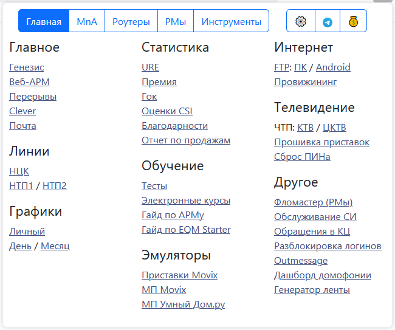
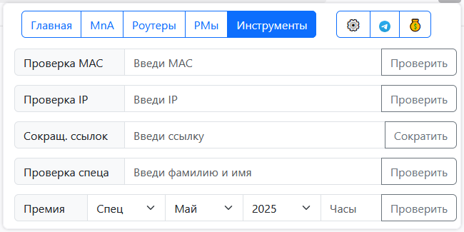
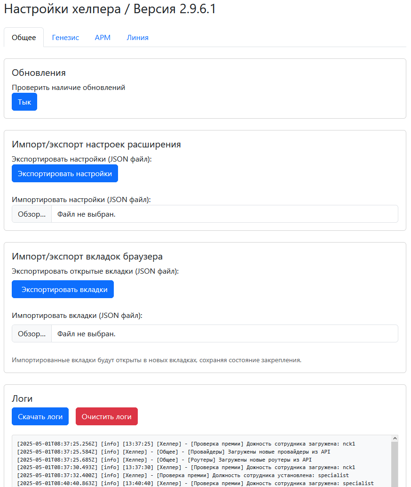
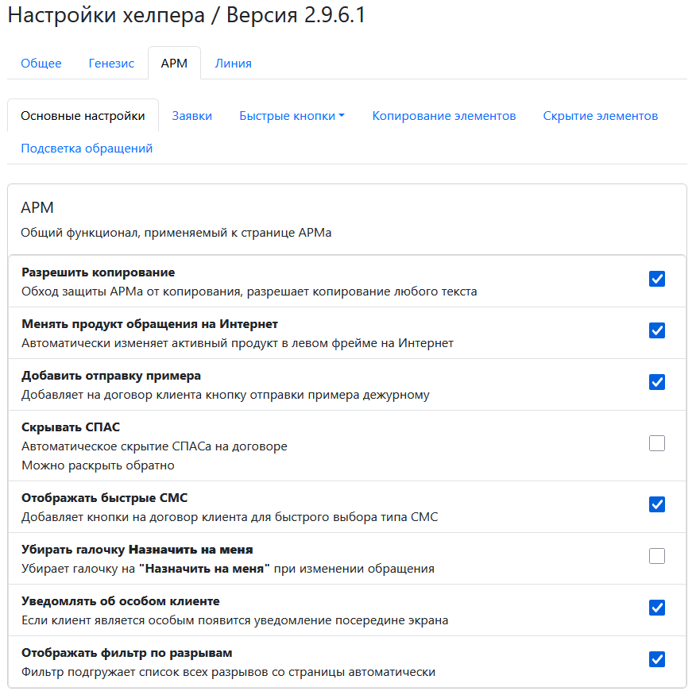

# 🚀 Helper extension

A powerful, productivity-boosting Firefox extension tailored for [ER-Telecom](https://ertelecom.ru/) customer tech support agents. 
Designed with integrations for Genesys, ARM, and Line systems, it delivers seamless automation, UI enhancements, custom sounds, and smart utility tools — all in one place.

---

## 🌟 Key Features

### 🔧 Interface Enhancements
- Context-aware buttons and highlights for **Genesys**, **ARM**, and **Line**
- Dynamic folding and search tools for dense UI layouts
- Smart tooltips and contextual actions

### 🔔 Notification System
- 9 preloaded sounds + 1 custom sound effect for different Genesys chat events
- Easy sound management and configuration

### ⚙️ Popup Dashboard
- Instant access to logs, tools, and updates
- Version checker and update viewer
- Quick-launch buttons for specific platform tools

### 📥 Background Utilities
- Periodic update checks and logs
- Smart cookie fetcher for session handling
- Privacy consent management

### 🔐 Settings Interface
- Logging control and verbosity
- Feature toggles and configuration management

---

## 💡 Functionality Breakdown

### 📁 Genesys Tools
- `genesysInit.js`: Initializes Genesys-specific enhancements
- `buttons.js`: Adds quick-access action buttons
- `utility.js`: Helpers for common Genesys interactions
- `integrations.js`: Hooks for deeper platform interop

### 🛠️ ARM Tools
- `armInit.js`: Entry point for ARM features
- `buttons.js`: Custom actions for streamlining tasks
- `search.js`: Advanced search in data-heavy views
- `highlights.js`: Intelligent row highlighting
- `folding.js`, `checkboxes.js`: Batch UI toggles

### 📞 Line Tools
- `lineInit.js`: Core Line platform enhancer
- `fastButtons.js`: Speed up routine interactions
- `countAppointments.js`: Real-time appointment tracking
- `highlight.js`: Visual improvements

### 📚 Extension Internals
- `background/` scripts: Manage updates, cookies, privacy
- `popup/` scripts: UI interactions for popup interface
- `settings/` scripts: Logger + settings loader/saver

---

## 🧩 Tech Stack

- HTML, CSS, JavaScript
- Bootstrap 5, jQuery
- Firefox Extensions APIs - Manifest v2 (v3 is not planned) 
- Marked.js for rendering updates
- DOMPurify for secure content

---

## 📂 Project Structure

```
helper-ext/
├── icons/                # Extension icons
├── pages/                # Popup, settings, updates, privacy
├── resources/sounds/     # Notification sounds
├── scripts/
│   ├── external/         # Bootstrap, jQuery, Marked.js, DOMPurify
│   └── internal/
│       ├── arm/          # ARM integration
│       ├── genesys/      # Genesys integration
│       ├── line/         # Line integration
│       └── ext/          # Extension logic (popup, background, settings)
├── styles/               # UI styles
├── manifest.json         # Extension metadata
└── README.md             # You're here
```

---

## 🏭 Production Setup

1. Open Firefox
2. Go to helper.chrsnv.ru.
3. Click on the installation button.
4. Agree with all pop-ups.

---

## 🧪 Development Setup

1. Download or clone this repository.
2. Open Firefox and go to `about:addons`.
3. Click on gear icon
4. Choose **Install Add-on From File** and select the manifest.json file.

---

## 📸 Screenshots

**Popup Dashboard**  



**Settings Panel**  



---

## 📜 License

This project is licensed under the [MIT License](LICENSE).

---

## 🤝 Contribute

Want to improve the extension? Add features? Report a bug?  
Pull requests and feedback are always welcome!
